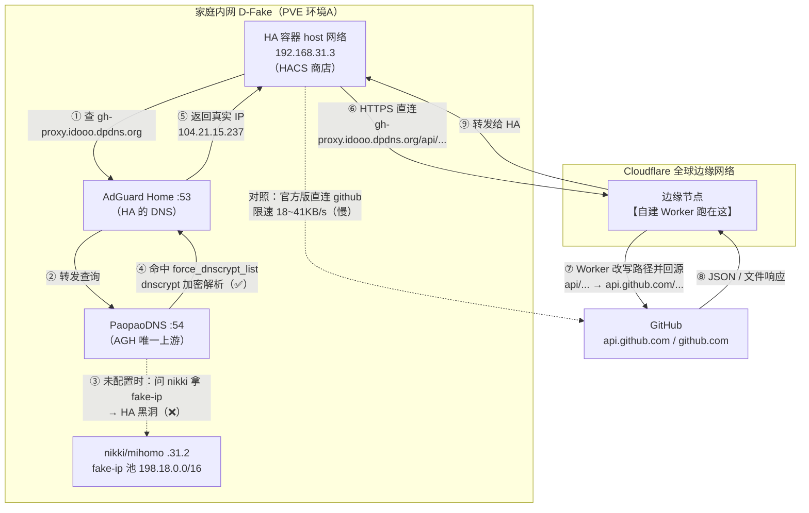

# gh-proxy

自建 Cloudflare Worker 镜像 GitHub API。

## 1. 简介

### 1.1 痛点

HACS 商店的核心数据（仓库列表、搜索、下载地址）来自 GitHub：

- `api.github.com` —— 商店数据 API
- `github.com` / `codeload.github.com` —— 下载集成源码
- `raw.githubusercontent.com` —— 前端插件资源

国内直连 github 的问题：DNS 污染、真实 IP 限速（实测 18~41KB/s）、大文件 60s 超时。官方版 HACS 商店内下载就是直连，所以慢。

### 1.2 Cloudflare Worker 是什么

**Cloudflare Worker = 跑在 Cloudflare 全球边缘节点上的 JavaScript 程序**（基于 V8 引擎，无服务器）。

- 请求到达**离用户最近的 Cloudflare 边缘节点**时，你的 JS 代码被执行；
- 代码里可以用 `fetch()` 去任何地址**回源**，拿到响应后加工再返回——这就是**反向代理**；
- 对客户端来说完全透明：HA 请求的是 `https://gh-proxy.idooo.dpdns.org/api/...`，收到的响应与直接请求 `api.github.com` 一模一样（Worker 只是中间转了一次手）。

**快在哪**（三点）：

1. Cloudflare 边缘 IP（104.21.x / 172.67.x）国内可直连，不像 github 的 IP 被墙/污染/限速；
1. Cloudflare ↔ GitHub 之间的骨干链路质量好、速度快；
1. 免费额度 10 万次请求/天，HACS 的 API 调用量远用不完。

### 1.3 完整链路（拓扑图）

### 1.4 为什么必须绑自有域名

Worker 默认域名 `*.workers.dev` **国内被墙**（SNI 阻断），必须绑定自有域名才能用。

- 绑自有域名后走 Cloudflare 通用 Anycast IP（104.21.x / 172.67.x），SNI 是自己的域名，不被墙；
- 本机用的 `idooo.dpdns.org`（动态 DNS 域名）可用。
## 2. 实操步骤

### 2.1 获取 Worker 代码

用 hacs-china 官方仓库的现成代码：<https://github.com/hacs-china/gh-proxy/blob/master/index.js>

### 2.2 创建 Worker

1. 登录 Cloudflare → **Workers 和 Pages** → **创建** → **创建 Worker** → 选择 **HTTP 处理程序**；
1. 把 index.js 全部代码粘贴进编辑器 → **部署**。

### 2.3 绑定自有域名

1. 进入 **域**（idooo.dpdns.org）→ **自定义域和路由** → **添加域名**；
1. 选择 `idooo.dpdns.org`，子域名填 `gh-proxy` → 确定。

完成后 DNS 自动生效：`gh-proxy.idooo.dpdns.org` 解析到 Cloudflare 的 104.21.x / 172.67.x。

### 2.4 验证（⚠️ 必须带尾斜杠）

| 验证地址 | 预期结果 |
| --- | --- |
| `https://gh-proxy.idooo.dpdns.org/` | 302 跳转 `github.com/hacs-china` |
| `https://gh-proxy.idooo.dpdns.org/api/` | 返回 api.github.com 的 JSON 根文档 |
| `https://gh-proxy.idooo.dpdns.org/api/rate_limit` | 返回真实的 rate_limit JSON |

验证 `https://gh-proxy.idooo.dpdns.org/api`（**无尾斜杠**）返回 "404 File not found ... GitHub Pages" —— 这是**假警报**！Worker 代码只匹配 `api/` 开头的路径，`/api` 不带斜杠落进兜底分支，转去作者静态站 `hunshcn.github.io/gh-proxy/api` 拿文件，自然 404。三个带斜杠的测试全部通过即说明 Worker 正常。
